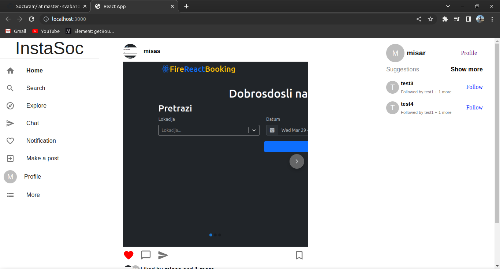
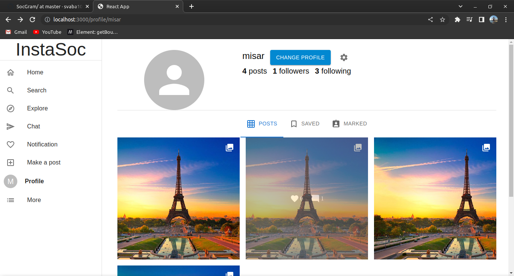
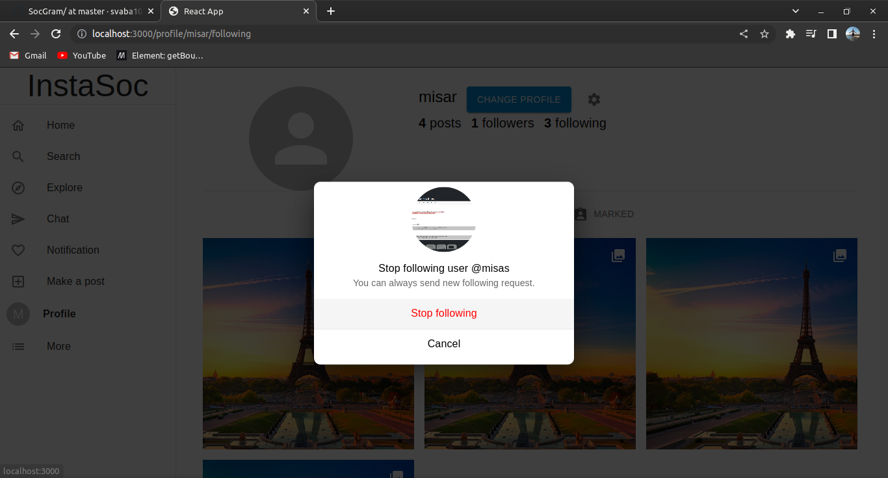
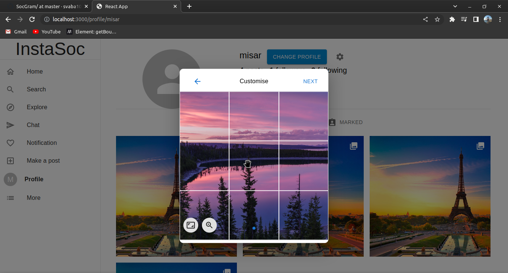
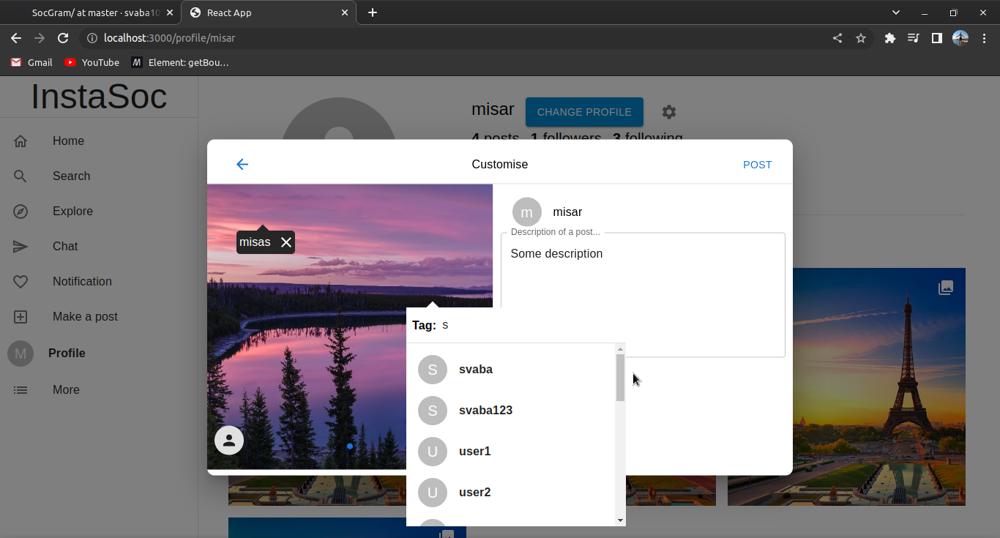
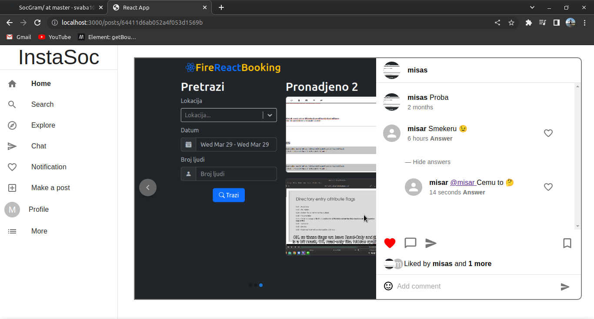

# SocGram
> SocGram, social media app, built using MERN stack, REST API as backend. SocGram or InstaSoc is copy of Instagram 

### Here are some pictures of app

### *!!!* There are currently lot of errors and unfinished things.
#### Some of them: 
1. Follow button is suggestions list is unfunctional.
2. Suggestion page is not created yet(Show more link on suggestions list isn't functional)
3. Menus (Navigation) has some items that point to pages that aren't implemeted yet.
4. Search can be easly implemented using search functionality built for tagging people which is not implemented on the backend (Currently it return all of the existing users not the ones which username maches search text).
5. Image cropping don't support all types of image formats.
6. Posts can be created in 1:1, 4:5 and 16:9 aspect ratios, but only 1:1 is tested.
7. Closing of creating post modal when posting new post.
8. Option modal menu on profile page is unfunctional.
9. Comments liking isn't implemented.
10. ...
